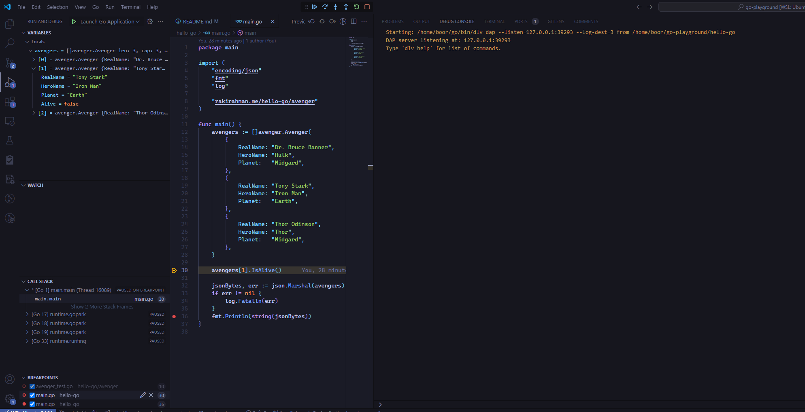
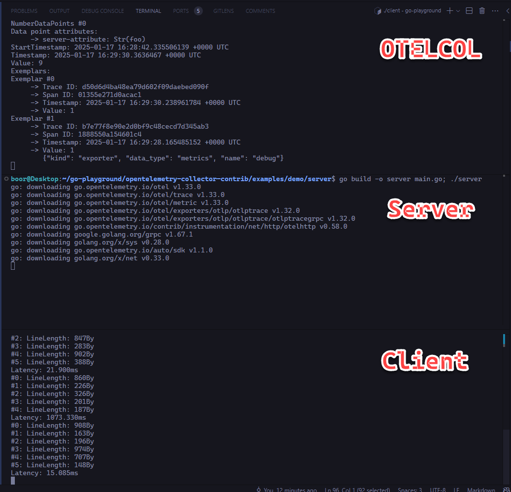
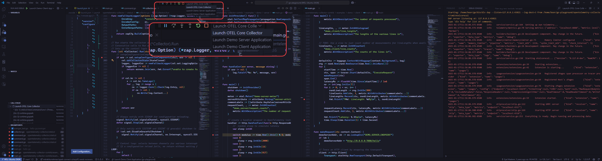
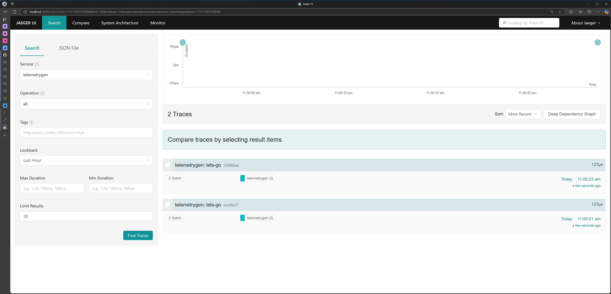
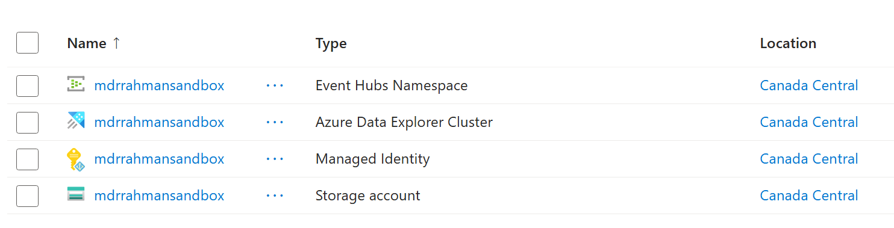

# Go playground

## Style Guide

* [Uber's Style Guide](https://github.com/uber-go/guide/blob/master/style.md)

## Dev env setup

1. Get a fresh new WSL machine up:

   ```powershell
   # Delete old WSL
   wsl --unregister Ubuntu-24.04
   ```

   ```powershell
   # Create new WSL
   wsl --install -d Ubuntu-24.04
   ```

2. Clone the repo, and open VSCode in it:

   ```bash
   cd ~/

   git config --global user.name "Raki Rahman"
   git config --global user.email "mdrakiburrahman@gmail.com"

   git clone https://github.com/mdrakiburrahman/go-playground.git

   cd go-playground/
   code .
   ```

3. Reset your docker WSL integration since this is a new VM:

   > `Docker Desktop: Settings > Resources > WSL Integration > Turn off/on Ubuntu-24.04`

4. Bootstrap your dev env

   ```bash
   GIT_ROOT=$(git rev-parse --show-toplevel)
   chmod +x ${GIT_ROOT}/contrib/bootstrap-dev-env.sh && ${GIT_ROOT}/contrib/bootstrap-dev-env.sh && source ~/.bashrc
   ```

## `hello-go` - a simple app

```bash
cd hello-go

go run main.go
go test ./...
```

The debugger settings should also work (first time debug takes a few seconds to boot):



## `sni-go` - a way to get an SNI cert

```bash
cd sni-go

az login --use-device-code

export VAULT_URL="https://a...d.vault.azure.net/"
export CERT_NAME="s...i"
export CLIENT_ID="e...7"
export TENANT_ID="7...7"
export SCOPE="https://database.windows.net/.default"

go run main.go
```

## `cert-auth-go` - use a local cert to auth

```bash
cd cert-auth-go

go run main.go \
   --cert-abs-path "${GIT_ROOT}/cert-auth-go/.secrets/myCert.cer" \
   --tenant-id $(jq -r '.tenantId' /home/boor/go-playground/cert-auth-go/.secrets/agentconfig.json) \
   --client-id $(jq -r '.clientId' /home/boor/go-playground/cert-auth-go/.secrets/agentconfig.json) \
   --scope "https://management.core.windows.net/.default"
```

## OpenTelemetry

### Client/Server demo to Core Collector

Spin up the OTEL Collector (Core) binary in one terminal:

```bash
cd ${GIT_ROOT}
git clone https://github.com/open-telemetry/opentelemetry-collector.git
cd opentelemetry-collector
make install-tools
make otelcorecol
./bin/otelcorecol_* --config ./examples/local/otel-config.yaml
```

Spin up an HTTP Server that sends OTEL metrics to our Collector above:

```bash
cd ${GIT_ROOT}
git clone https://github.com/open-telemetry/opentelemetry-collector-contrib.git
cd opentelemetry-collector-contrib/examples/demo/server
go build -o server main.go; ./server
```

And finally, the HTTP Client that sends requests
```bash
cd ${GIT_ROOT}
cd opentelemetry-collector-contrib/examples/demo/client
go build -o client main.go; ./client
```



Debug the Client, Collector and Server together:



### Building a Custom Collector

Install `ocb` CLI:

```
curl --proto '=https' --tlsv1.2 -fL -o ocb \
https://github.com/open-telemetry/opentelemetry-collector-releases/releases/download/cmd%2Fbuilder%2Fv0.117.0/ocb_0.117.0_linux_amd64
chmod +x ocb
./ocb help
```

Build the collector:

```
./ocb --config custom-collector-builder-config.yaml
```

### Building a Receiver, Connector, Exporter

Spin up Jaeger UI:

```bash
docker run -d --name jaeger \
  -e COLLECTOR_OTLP_ENABLED=true \
  -p 16686:16686 \
  -p 14317:4317 \
  -p 14318:4318 \
  jaegertracing/all-in-one:1.41
```

Generate traces:

```
go install github.com/open-telemetry/opentelemetry-collector-contrib/cmd/telemetrygen@latest
telemetrygen traces --otlp-insecure --traces 1
```

View in Jaeger UI at `http://localhost:16686/`:



Initiate the go workspace:

```bash
cd ${GIT_ROOT}/opentelemetry-collector-raki

go work init
go work use otelcol-raki
go work use tailtracer
go work use exampleconnector
go work use emptyexporter
go work use marshaler
```

Run the Collector with the receiver wired up, either use VSCOde debugging, or via `go`:

```bash
go run ./otelcol-raki --config ${GIT_ROOT}/custom-collector-runtime-config-primary.yaml
```

* `custom-collector-runtime-config-primary.yaml`: Contains custom connectors
* `custom-collector-runtime-config-filelog.yaml`: Contains filelog receiver

> To add a specific package in go, e.g. we run `go get github.com/open-telemetry/opentelemetry-collector-contrib/receiver/filelogreceiver@v0.115.0`

To demo the filelog receiver:

```bash
# Run in one terminal
go run ./otelcol-raki --config ${GIT_ROOT}/custom-collector-runtime-config-filelog.yaml

# Append in another terminal
export TEMP="/home/boor/go-playground/.temp"
export K8S_NAMESPACE="my-bar-namespace"
export K8S_POD="my-foo-pod"
export K8S_UID=$(uuidgen)
export K8S_CONTAINER="my-qux-container"
export K8S_CONTAINER_RESTART_NUM="0"
export FOLDER="${TEMP}/${K8S_NAMESPACE}_${K8S_POD}_${K8S_UID}/${K8S_CONTAINER}"
export FILE="${FOLDER}/${K8S_CONTAINER_RESTART_NUM}.log"

rm -rf ${TEMP}
mkdir -p ${FOLDER}
touch ${FILE}

echo "$(date '+%Y-%m-%d %H:%M:%S') ERROR This is a test error message" >> ${FILE}
echo "$(date '+%Y-%m-%d %H:%M:%S') DEBUG This is a test debug message" >> ${FILE}
echo "$(date '+%Y-%m-%d %H:%M:%S') INFO This is a test informational message" >> ${FILE}
```

The OTEL logs will show:

```
2025-03-01T13:34:09.156-0500    info    ResourceLog #0
Resource SchemaURL: 
Resource attributes:
     -> service.name: Str(my-bar-namespace/my-foo-pod/my-qux-container/0)
ScopeLogs #0
ScopeLogs SchemaURL: 
InstrumentationScope  
LogRecord #0
ObservedTimestamp: 2025-03-01 18:34:09.05617885 +0000 UTC
Timestamp: 1970-01-01 00:00:00 +0000 UTC
SeverityText: 
SeverityNumber: Unspecified(0)
Body: Str(2025-03-01 13:05:03 ERROR This is a test error message)
Attributes:
     -> container_name: Str(my-qux-container)
     -> restart_count: Str(0)
     -> namespace: Str(my-bar-namespace)
     -> log.file.path: Str(/home/boor/go-playground/.temp/my-bar-namespace_my-foo-pod_1e1f3d4b-c5a9-4092-a9c8-c7a4ea78c405/my-qux-container/0.log)
     -> log.file.name: Str(0.log)
     -> pod_name: Str(my-foo-pod)
     -> uid: Str(1e1f3d4b-c5a9-4092-a9c8-c7a4ea78c405)
Trace ID: 
Span ID: 
Flags: 0
        {"kind": "exporter", "data_type": "logs", "name": "debug"}
```

We don't do fancy RegEx parsing for timestamps and stuff. The `ObservedTimestamp` is good enough.

## Parquet

Following [The Go Developer's Guide to Using Apache Arrow: Reading and Writing Parquet Files](https://www.sobyte.net/post/2023-08/go-apache-arrow-parquet/).

```bash
cd hello-parquet-go
```

```bash
# Create a simple parquet file from an Arrow Table
go run to_parquet/flat_table_to_parquet.go

# Look at it
parquet_reader flat_table.parquet
```

Output:

```text
File name: flat_table.parquet
Version: v2.6
Created By: parquet-go version 13.0.0
Num Rows: 10
Number of RowGroups: 2
Number of Real Columns: 3
Number of Columns: 3
Number of Selected Columns: 3
Column 0: col1 (INT32/INT_32)
Column 1: col2 (DOUBLE)
Column 2: col3 (BYTE_ARRAY/UTF8)
--- Row Group: 0  ---
--- Total Bytes: 306  ---
--- Rows: 6  ---
Column 0
 Values: 6, Min: 1, Max: 6, Null Values: 0, Distinct Values: 0
 Compression: UNCOMPRESSED, Encodings: RLE_DICTIONARY PLAIN RLE
 Uncompressed Size: 90, Compressed Size: 90
Column 1
 Values: 6, Min: 1.1, Max: 6.6, Null Values: 0, Distinct Values: 0
 Compression: UNCOMPRESSED, Encodings: RLE_DICTIONARY PLAIN RLE
 Uncompressed Size: 130, Compressed Size: 130
Column 2
 Values: 6, Min: [115 49], Max: [115 54], Null Values: 0, Distinct Values: 0
 Compression: UNCOMPRESSED, Encodings: RLE_DICTIONARY PLAIN RLE
 Uncompressed Size: 86, Compressed Size: 86
--- Values ---
col1              |col2              |col3              |
1                 |1.100000          |s1                |
2                 |2.200000          |s2                |
3                 |3.300000          |s3                |
4                 |4.400000          |s4                |
5                 |5.500000          |s5                |
6                 |6.600000          |s6                |

--- Row Group: 1  ---
--- Total Bytes: 269  ---
--- Rows: 4  ---
Column 0
 Values: 4, Min: 7, Max: 10, Null Values: 0, Distinct Values: 0
 Compression: UNCOMPRESSED, Encodings: RLE_DICTIONARY PLAIN RLE
 Uncompressed Size: 81, Compressed Size: 81
Column 1
 Values: 4, Min: 7.7, Max: 10, Null Values: 0, Distinct Values: 0
 Compression: UNCOMPRESSED, Encodings: RLE_DICTIONARY PLAIN RLE
 Uncompressed Size: 113, Compressed Size: 113
Column 2
 Values: 4, Min: [115 49 48], Max: [115 57], Null Values: 0, Distinct Values: 0
 Compression: UNCOMPRESSED, Encodings: RLE_DICTIONARY PLAIN RLE
 Uncompressed Size: 75, Compressed Size: 75
--- Values ---
col1              |col2              |col3              |
7                 |7.700000          |s7                |
8                 |8.800000          |s8                |
9                 |9.900000          |s9                |
10                |10.000000         |s10               |
```

Read back:

```bash
go run from_parquet/flat_table_from_parquet.go
```

```text
schema:
  fields: 3
    - col1: type=int32
      metadata: ["PARQUET:field_id": "-1"]
    - col2: type=float64
      metadata: ["PARQUET:field_id": "-1"]
    - col3: type=utf8
      metadata: ["PARQUET:field_id": "-1"]
------
the count of table columns= 3
the count of table rows= 10
------
arrays in column(col1):
[1 2 3 4 5 6 7 8 9 10]
------
arrays in column(col2):
[1.1 2.2 3.3 4.4 5.5 6.6 7.7 8.8 9.9 10]
------
arrays in column(col3):
["s1" "s2" "s3" "s4" "s5" "s6" "s7" "s8" "s9" "s10"]
------
```

```bash
# Create a compressed parquet file from an Arrow Table
go run to_parquet_compressed/flat_table_to_parquet_compressed.go

# Look at it
parquet_reader flat_table_compressed.parquet
```

Output:

```text
File name: flat_table_compressed.parquet
Version: v2.6
Created By: parquet-go version 13.0.0
Num Rows: 10
Number of RowGroups: 1
Number of Real Columns: 3
Number of Columns: 3
Number of Selected Columns: 3
Column 0: col1 (INT32/INT_32)
Column 1: col2 (DOUBLE)
Column 2: col3 (BYTE_ARRAY/UTF8)
--- Row Group: 0  ---
--- Total Bytes: 352  ---
--- Rows: 10  ---
Column 0
 Values: 10, Min: 1, Max: 10, Null Values: 0, Distinct Values: 0
 Compression: BROTLI, Encodings: RLE_DICTIONARY PLAIN RLE
 Uncompressed Size: 111, Compressed Size: 98
Column 1
 Values: 10, Min: 1.1, Max: 10, Null Values: 0, Distinct Values: 0
 Compression: SNAPPY, Encodings: RLE_DICTIONARY PLAIN RLE
 Uncompressed Size: 168, Compressed Size: 148
Column 2
 Values: 10, Min: [115 49], Max: [115 57], Null Values: 0, Distinct Values: 0
 Compression: SNAPPY, Encodings: RLE_DICTIONARY PLAIN RLE
 Uncompressed Size: 116, Compressed Size: 106
--- Values ---
col1              |col2              |col3              |
1                 |1.100000          |s1                |
2                 |2.200000          |s2                |
3                 |3.300000          |s3                |
4                 |4.400000          |s4                |
5                 |5.500000          |s5                |
6                 |6.600000          |s6                |
7                 |7.700000          |s7                |
8                 |8.800000          |s8                |
9                 |9.900000          |s9                |
10                |10.000000         |s10               |
```

Look at the compressed file size:

```bash
ls -lars
4 -rw-r--r--  1 boor boor  733 Jun 17 12:25 flat_table_compressed.parquet
4 -rw-r--r--  1 boor boor 1219 Jun 17 11:51 flat_table.parquet
```

```bash
# Create a parquet file from an Arrow RecordBatch
go run to_parquet_recordbatch/flat_record_to_parquet.go

# Look at it
parquet_reader flat_record.parquet
```

Output:

```text
File name: flat_record.parquet
Version: v2.6
Created By: parquet-go version 13.0.0
Num Rows: 9
Number of RowGroups: 3
Number of Real Columns: 3
Number of Columns: 3
Number of Selected Columns: 3
Column 0: archer (BYTE_ARRAY/UTF8)
Column 1: location (BYTE_ARRAY/UTF8)
Column 2: year (INT32/INT_16)
--- Row Group: 0  ---
--- Total Bytes: 255  ---
--- Rows: 3  ---
Column 0
 Values: 3, Min: [97 109 121 48], Max: [116 111 110 121 48], Null Values: 0, Distinct Values: 0
 Compression: UNCOMPRESSED, Encodings: RLE_DICTIONARY PLAIN RLE
 Uncompressed Size: 79, Compressed Size: 79
Column 1
 Values: 3, Min: [98 101 105 106 105 110 103 48], Max: [115 104 97 110 103 104 97 105 48], Null Values: 0, Distinct Values: 0
 Compression: UNCOMPRESSED, Encodings: RLE_DICTIONARY PLAIN RLE
 Uncompressed Size: 99, Compressed Size: 99
Column 2
 Values: 3, Min: 1992, Max: 1994, Null Values: 0, Distinct Values: 0
 Compression: UNCOMPRESSED, Encodings: RLE_DICTIONARY PLAIN RLE
 Uncompressed Size: 77, Compressed Size: 77
--- Values ---
archer            |location          |year              |
tony0             |beijing0          |1992              |
amy0              |shanghai0         |1993              |
jim0              |chengdu0          |1994              |

--- Row Group: 1  ---
--- Total Bytes: 255  ---
--- Rows: 3  ---
Column 0
 Values: 3, Min: [97 109 121 49], Max: [116 111 110 121 49], Null Values: 0, Distinct Values: 0
 Compression: UNCOMPRESSED, Encodings: RLE_DICTIONARY PLAIN RLE
 Uncompressed Size: 79, Compressed Size: 79
Column 1
 Values: 3, Min: [98 101 105 106 105 110 103 49], Max: [115 104 97 110 103 104 97 105 49], Null Values: 0, Distinct Values: 0
 Compression: UNCOMPRESSED, Encodings: RLE_DICTIONARY PLAIN RLE
 Uncompressed Size: 99, Compressed Size: 99
Column 2
 Values: 3, Min: 1993, Max: 1995, Null Values: 0, Distinct Values: 0
 Compression: UNCOMPRESSED, Encodings: RLE_DICTIONARY PLAIN RLE
 Uncompressed Size: 77, Compressed Size: 77
--- Values ---
archer            |location          |year              |
tony1             |beijing1          |1993              |
amy1              |shanghai1         |1994              |
jim1              |chengdu1          |1995              |

--- Row Group: 2  ---
--- Total Bytes: 255  ---
--- Rows: 3  ---
Column 0
 Values: 3, Min: [97 109 121 50], Max: [116 111 110 121 50], Null Values: 0, Distinct Values: 0
 Compression: UNCOMPRESSED, Encodings: RLE_DICTIONARY PLAIN RLE
 Uncompressed Size: 79, Compressed Size: 79
Column 1
 Values: 3, Min: [98 101 105 106 105 110 103 50], Max: [115 104 97 110 103 104 97 105 50], Null Values: 0, Distinct Values: 0
 Compression: UNCOMPRESSED, Encodings: RLE_DICTIONARY PLAIN RLE
 Uncompressed Size: 99, Compressed Size: 99
Column 2
 Values: 3, Min: 1994, Max: 1996, Null Values: 0, Distinct Values: 0
 Compression: UNCOMPRESSED, Encodings: RLE_DICTIONARY PLAIN RLE
 Uncompressed Size: 77, Compressed Size: 77
--- Values ---
archer            |location          |year              |
tony2             |beijing2          |1994              |
amy2              |shanghai2         |1995              |
jim2              |chengdu2          |1996              |
```

Read back:

```bash
go run from_parquet_recordbatch/flat_record_from_parquet.go
```

```text
{[{archer 0x1fdde40 false {[PARQUET:field_id] [-1]}} {location 0x1fdde40 false {[PARQUET:field_id] [-1]}} {year 0x1fdde40 false {[PARQUET:field_id] [-1]}}] map[archer:[0] location:[1] year:[2]] {[] []} 0}
record:
  schema:
  fields: 3
    - archer: type=utf8
        metadata: ["PARQUET:field_id": "-1"]
    - location: type=utf8
          metadata: ["PARQUET:field_id": "-1"]
    - year: type=int16
      metadata: ["PARQUET:field_id": "-1"]
  rows: 3
  col[0][archer]: ["tony0" "amy0" "jim0"]
  col[1][location]: ["beijing0" "shanghai0" "chengdu0"]
  col[2][year]: [1992 1993 1994]

record:
  schema:
  fields: 3
    - archer: type=utf8
        metadata: ["PARQUET:field_id": "-1"]
    - location: type=utf8
          metadata: ["PARQUET:field_id": "-1"]
    - year: type=int16
      metadata: ["PARQUET:field_id": "-1"]
  rows: 3
  col[0][archer]: ["tony1" "amy1" "jim1"]
  col[1][location]: ["beijing1" "shanghai1" "chengdu1"]
  col[2][year]: [1993 1994 1995]

record:
  schema:
  fields: 3
    - archer: type=utf8
        metadata: ["PARQUET:field_id": "-1"]
    - location: type=utf8
          metadata: ["PARQUET:field_id": "-1"]
    - year: type=int16
      metadata: ["PARQUET:field_id": "-1"]
  rows: 3
  col[0][archer]: ["tony2" "amy2" "jim2"]
  col[1][location]: ["beijing2" "shanghai2" "chengdu2"]
  col[2][year]: [1994 1995 1996]
```

Write RecordBatch compressed:

```bash
go run to_parquet_recordbatch_compressed/flat_record_to_parquet_compressed.go
```

```bash
# Compression is poor:
parquet_reader flat_record_compressed.parquet
```

```text
File name: flat_record_compressed.parquet
Version: v2.6
Created By: parquet-go version 13.0.0
Num Rows: 9
Number of RowGroups: 3
Number of Real Columns: 3
Number of Columns: 3
Number of Selected Columns: 3
Column 0: archer (BYTE_ARRAY/UTF8)
Column 1: location (BYTE_ARRAY/UTF8)
Column 2: year (INT32/INT_16)
--- Row Group: 0  ---
--- Total Bytes: 315  ---
--- Rows: 3  ---
Column 0
 Values: 3, Min: [97 109 121 48], Max: [116 111 110 121 48], Null Values: 0, Distinct Values: 0
 Compression: ZSTD, Encodings: RLE_DICTIONARY PLAIN RLE
 Uncompressed Size: 79, Compressed Size: 105
Column 1
 Values: 3, Min: [98 101 105 106 105 110 103 48], Max: [115 104 97 110 103 104 97 105 48], Null Values: 0, Distinct Values: 0
 Compression: ZSTD, Encodings: RLE_DICTIONARY PLAIN RLE
 Uncompressed Size: 99, Compressed Size: 125
Column 2
 Values: 3, Min: 1992, Max: 1994, Null Values: 0, Distinct Values: 0
 Compression: BROTLI, Encodings: RLE_DICTIONARY PLAIN RLE
 Uncompressed Size: 77, Compressed Size: 85
--- Values ---
archer            |location          |year              |
tony0             |beijing0          |1992              |
amy0              |shanghai0         |1993              |
jim0              |chengdu0          |1994              |

--- Row Group: 1  ---
--- Total Bytes: 315  ---
--- Rows: 3  ---
Column 0
 Values: 3, Min: [97 109 121 49], Max: [116 111 110 121 49], Null Values: 0, Distinct Values: 0
 Compression: ZSTD, Encodings: RLE_DICTIONARY PLAIN RLE
 Uncompressed Size: 79, Compressed Size: 105
Column 1
 Values: 3, Min: [98 101 105 106 105 110 103 49], Max: [115 104 97 110 103 104 97 105 49], Null Values: 0, Distinct Values: 0
 Compression: ZSTD, Encodings: RLE_DICTIONARY PLAIN RLE
 Uncompressed Size: 99, Compressed Size: 125
Column 2
 Values: 3, Min: 1993, Max: 1995, Null Values: 0, Distinct Values: 0
 Compression: BROTLI, Encodings: RLE_DICTIONARY PLAIN RLE
 Uncompressed Size: 77, Compressed Size: 85
--- Values ---
archer            |location          |year              |
tony1             |beijing1          |1993              |
amy1              |shanghai1         |1994              |
jim1              |chengdu1          |1995              |

--- Row Group: 2  ---
--- Total Bytes: 315  ---
--- Rows: 3  ---
Column 0
 Values: 3, Min: [97 109 121 50], Max: [116 111 110 121 50], Null Values: 0, Distinct Values: 0
 Compression: ZSTD, Encodings: RLE_DICTIONARY PLAIN RLE
 Uncompressed Size: 79, Compressed Size: 105
Column 1
 Values: 3, Min: [98 101 105 106 105 110 103 50], Max: [115 104 97 110 103 104 97 105 50], Null Values: 0, Distinct Values: 0
 Compression: ZSTD, Encodings: RLE_DICTIONARY PLAIN RLE
 Uncompressed Size: 99, Compressed Size: 125
Column 2
 Values: 3, Min: 1994, Max: 1996, Null Values: 0, Distinct Values: 0
 Compression: BROTLI, Encodings: RLE_DICTIONARY PLAIN RLE
 Uncompressed Size: 77, Compressed Size: 85
--- Values ---
archer            |location          |year              |
tony2             |beijing2          |1994              |
amy2              |shanghai2         |1995              |
jim2              |chengdu2          |1996              |
```

> I.e. compression INCREASES the size here!

Write to ADLS:

```bash
az login --use-device-code

# Run with memory buffer
go run to_parquet_adls/azure_blob_parquet.go "mdrrahmansandbox" "onelake"

# Run streaming
go run to_parquet_adls_streaming/azure_blob_parquet_streaming.go "mdrrahmansandbox" "onelake"
```

### Kusto

Following this [tutorial](https://learn.microsoft.com/en-us/azure/data-explorer/ingest-data-event-grid-manual) to create the Event Grid -> Event Hub subscription.



In Kusto, create the table under `database-1` and `database-2`:

```kql

// Also do table-2
.create-merge table [table-1] (
   [archer]:   string,
   [location]: string,
   [year]:     int
)

// Also do table-2
.alter table [table-1] policy partitioning 
```
{
  "PartitionKeys": [
    {
      "ColumnName": "location",
      "Kind": "Hash",
      "Properties": {
        "Function": "XxHash64",
        "MaxPartitionCount": 128,
        "PartitionAssignmentMode": "Uniform"
      }
    }
  ]
}
```

.alter database [database-1] policy ingestionbatching 
```
{
    "MaximumBatchingTimeSpan" : "00:00:10",
    "MaximumNumberOfItems" : 50,
    "MaximumRawDataSizeMB" : 100
}
```

Then [this](https://learn.microsoft.com/en-us/azure/data-explorer/create-event-grid-connection?tabs=portal-adx%2Cazure-blob-storage) - to attach the Event Grid to Kusto.

Ingest, and query:

```kql
['table-1'] | extend kustoIngestionTimestamp = ingestion_time() | limit 1000
```

### Delta

```bash
# Check arrow schema conversion
go run from_arrow_to_delta/delta_schema_converter.go

# APPEND generation
go run to_delta_append/delta_append_metadata.go
```